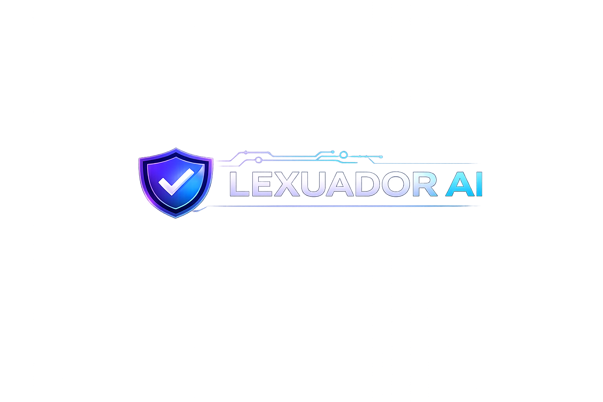
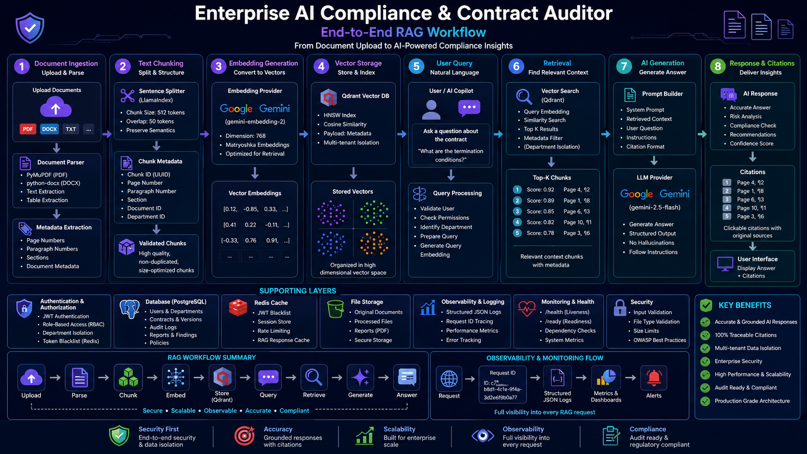
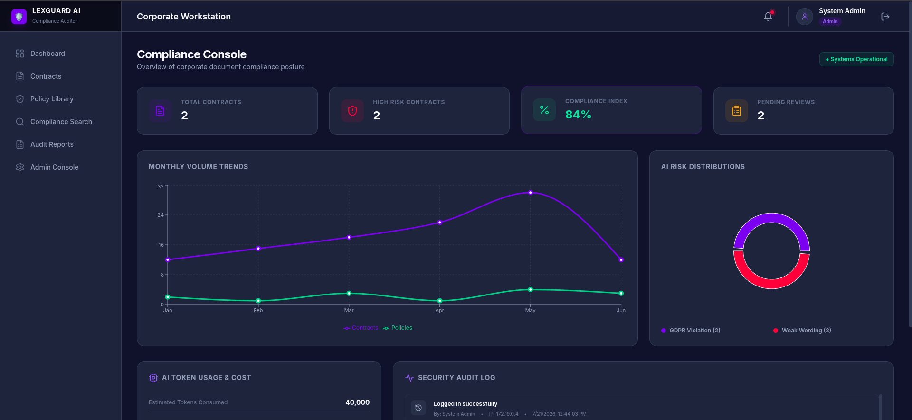
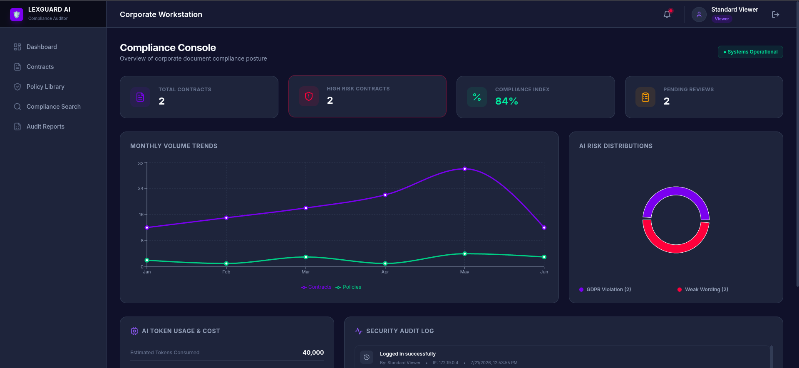
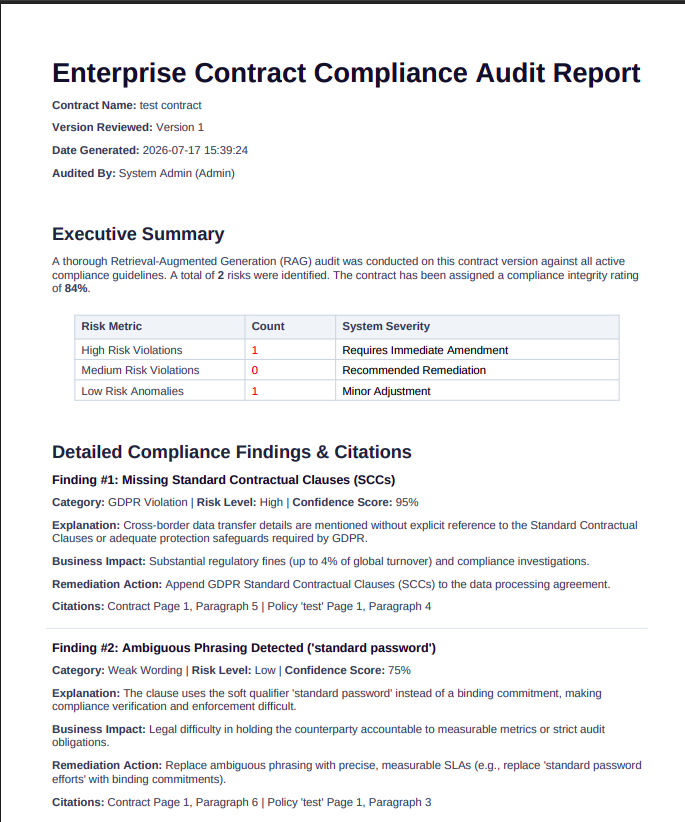
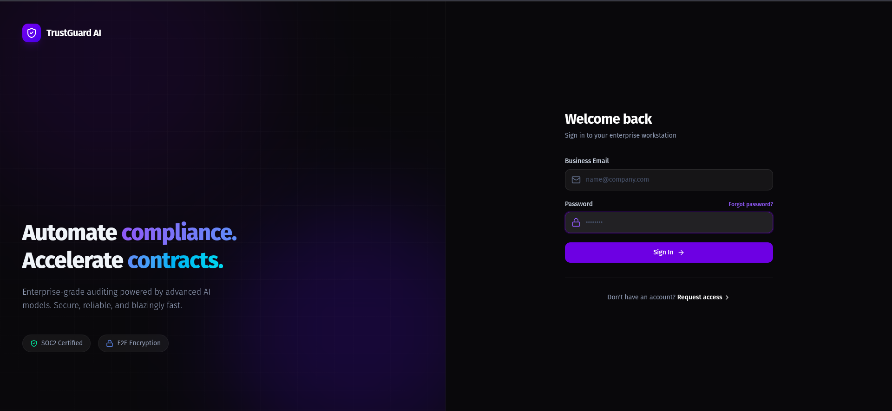

<div align="center">
  

  <h1>Enterprise AI Compliance & Contract Auditor</h1>
  <p><i>A production-grade, multi-tenant AI system for automated legal contract ingestion, policy comparison, and risk analysis using advanced RAG.</i></p>

  <!-- Status badges -->
  <a href="https://github.com/Manojkrishna27/ENTERPRISE-AI-COMPLIANCE-AUDITOR/actions"></a>
  <a href="https://python.org"></a>
  <a href="https://fastapi.tiangolo.com"></a>
  <a href="https://react.dev"></a>
  <a href="https://www.docker.com/"></a>
  <a href="https://opensource.org/licenses/MIT"></a>

  <br />

  <!-- Community / repo-stat badges — auto-populate once the repo is public/live -->
  <a href="https://github.com/Manojkrishna27/ENTERPRISE-AI-COMPLIANCE-AUDITOR/stargazers"></a>
  <a href="https://github.com/Manojkrishna27/ENTERPRISE-AI-COMPLIANCE-AUDITOR/network/members"></a>
  <a href="https://github.com/Manojkrishna27/ENTERPRISE-AI-COMPLIANCE-AUDITOR/issues"></a>
  <a href="https://github.com/Manojkrishna27/ENTERPRISE-AI-COMPLIANCE-AUDITOR/commits/main"></a>
  <a href="./CONTRIBUTING.md"></a>

  <br /><br />

  <a href="#why-this-exists">Why This Exists</a> •
  <a href="#key-features">Features</a> •
  <a href="#architecture--tech-stack">Architecture</a> •
  <a href="#getting-started">Getting Started</a> •
  <a href="#testing--quality-assurance">Testing</a> •
  <a href="#security--compliance">Security</a> •
  <a href="#roadmap">Roadmap</a> •
  <a href="#faq">FAQ</a>
</div>

<br />

## 📖 Overview

**Enterprise AI Compliance & Contract Auditor** is a full-stack, enterprise-ready SaaS platform that automates one of the most time-consuming parts of legal operations: contract review.

It ingests legal contracts (PDF, DOCX), semantically parses them, and uses **Retrieval-Augmented Generation (RAG)** to compare them against internal corporate policy. The system flags high-risk liabilities, missing mandatory clauses, and compliance gaps — cutting manual review time from hours to minutes while removing human error from the process.

Built with **security**, **multi-tenancy**, and **scalability** as first-class concerns, the platform is designed to hold up in Fortune 500 production environments, not just demos.

---

## 🎯 Why This Exists

Manual contract review doesn't scale. Legal teams routinely spend hours per contract cross-referencing clauses against internal policy, and the cost of missing a single non-standard liability or indemnification clause can run into the millions.

This project exists to make that review:

- **Faster** — a contract that takes a paralegal 2–3 hours to review can be triaged in minutes.
- **Consistent** — the same policy checklist is applied every time, with no reviewer fatigue or drift.
- **Auditable** — every flagged risk is backed by a retrieved citation from the source contract and the policy it violates, so legal can verify the "why," not just trust a black box.
- **Safe to scale across departments** — multi-tenant isolation means Legal, Procurement, and HR can all use the same platform without seeing each other's documents.

---

## 🔄 End-to-End RAG Workflow

From document upload to AI-powered compliance insight — the full pipeline, in one diagram:

<div align="center">
  
</div>

<p align="center"><i>8-stage pipeline: Document Ingestion → Text Chunking → Embedding Generation → Vector Storage → User Query → Retrieval → AI Generation → Response & Citations — backed by dedicated Auth, Database, Cache, Storage, Observability, and Security layers.</i></p>

---

## 📸 Screenshots

| Dashboard & Overview | Contract Upload & Viewer |
| :---: | :---: |
|  |  |
| **RAG Copilot & Audit** | **Generated Reports** |
|  |  |
| **Policy Standards** | **Secure Login** |
|  |  |

---

## ✨ Key Features

| | |
|---|---|
| 🧠 **Enterprise RAG Pipeline** | High-fidelity semantic chunking using PyMuPDF and LlamaIndex. |
| ⚡ **Dynamic AI Adapters** | Provider-agnostic architecture that dynamically supports Google Gemini (`gemini-1.5-flash`, `gemini-embedding-2`) and OpenAI. |
| 🎯 **Matryoshka Representation Vectors** | 768-dimensional Qdrant embeddings tuned for precise semantic spatial relations during retrieval. |
| 🔐 **Multi-Tenant Security** | Strict Role-Based Access Control (RBAC), `department_id`-level Qdrant isolation, `python-jose` OAuth2 tokens, and Redis-backed JWT blocklisting. |
| 🛡️ **Production Hardened** | Built-in request tracing (`X-Request-ID`), FastAPI global error handlers, Pydantic v2 schemas, auto-generated OpenAPI `/docs`, and deep `/ready` probes. |
| 📊 **Real-Time Interactive Dashboard** | Built with React, Recharts, and Tailwind CSS for seamless data visualization and Copilot interaction. |

---

## 🏗 Architecture & Tech Stack

The platform uses a containerized microservices architecture for isolated scaling, security, and maintainability.

### Frontend
- **Framework**: React 18 + Vite
- **Styling**: Tailwind CSS & Headless UI
- **Routing & State**: React Router DOM, Axios
- **Data Visualization**: Recharts

### Backend
- **Core API**: Python 3.12, FastAPI, Uvicorn (ASGI)
- **Validation**: Pydantic v2
- **Auth**: `python-jose`, `passlib[bcrypt]`, OAuth2 Dependency Injection
- **AI Core**: LlamaIndex, Google Gemini API / OpenAI
- **Document Processing**: PyMuPDF, python-docx

### Infrastructure & Data Tier
- **Relational DB**: PostgreSQL 15 & SQLAlchemy 2.0
- **Vector DB**: Qdrant (high-performance semantic search)
- **Cache & Security**: Redis (JWT blocklisting, session token management)
- **Deployment**: Docker Compose, Nginx reverse proxy (load balancing)

*(See [`docs/diagrams/system-architecture.puml`](./docs/diagrams/system-architecture.puml) for the full architectural diagram.)*

---

## 📂 Repository Structure

```text
.
├── backend/                  # Flask REST API, Services, and AI Providers
│   ├── app/                  # Application code (Routers, Models, Services)
│   ├── tests/                # Pytest Suite
│   ├── Dockerfile            # Backend container definition (non-root)
│   └── requirements.txt      # Python dependencies
├── frontend/                 # React Vite SPA
│   ├── src/                  # React components, pages, and context
│   ├── Dockerfile            # Frontend container definition
│   └── package.json          # Node dependencies
├── docs/                     # Comprehensive Markdown and PlantUML documentation
│   └── diagrams/             # Architecture & workflow diagrams (rag-workflow.png, etc.)
├── nginx/                    # Nginx reverse proxy configuration
├── docker-compose.yml        # Orchestration for the entire stack
└── .env.example              # Environment variables template
```

---

## 🚀 Getting Started

### Prerequisites

- [Docker](https://www.docker.com/get-started) and Docker Compose installed
- An API key from Google Gemini or OpenAI

### 1. Configuration

Clone the repository and set up your environment variables:

```bash
git clone https://github.com/Manojkrishna27/ENTERPRISE-AI-COMPLIANCE-AUDITOR.git
cd ENTERPRISE-AI-COMPLIANCE-AUDITOR

# Create the environment file
cp .env.example .env
```

Edit `.env` to add your `OPENAI_API_KEY` (also used for Gemini access depending on configuration), and generate secure values for `SECRET_KEY` and `JWT_SECRET_KEY`.

### 2. Deployment

The system is fully containerized. Spin up the entire stack with Docker Compose:

```bash
docker compose up -d --build
```

### 3. Verify Health

Confirm all subsystems (PostgreSQL, Redis, Qdrant, AI API) are operational via the deep readiness probe:

```bash
curl http://localhost:5001/api/ready
```

### 4. Access the Application

| Service | URL |
|---|---|
| Frontend Dashboard | `http://localhost:3000` |
| Swagger API Docs | `http://localhost:5001/apidocs` |

---

## 🧪 Testing & Quality Assurance

The backend ships with a comprehensive Pytest suite that mocks external dependencies to validate the RAG pipeline, chunking logic, and auth mechanisms.

Run the automated tests with:

```bash
docker compose exec backend pytest
```

---

## 🔐 Security & Compliance

This project follows strictly enforced OWASP standards:

- **Authentication** — JWT with Redis-backed blocklisting for secure, immediate logout.
- **Rate Limiting** — Granular protection on authentication, upload, and AI-inference endpoints to prevent abuse and quota exhaustion.
- **Payload Validation** — `MAX_CONTENT_LENGTH` restrictions and secure filename validation to prevent path traversal attacks.
- **Execution Isolation** — Docker containers run as non-root `appuser` to prevent privilege escalation.

---

## 🗺 Roadmap

- [ ] Redline generation — auto-suggest contract edits that resolve flagged risks
- [ ] Clause library — searchable repository of approved/standard clause language
- [ ] SSO (SAML / OIDC) for enterprise identity providers
- [ ] Batch contract comparison across an entire vendor portfolio
- [ ] Fine-tuned, self-hosted embedding model option for air-gapped deployments

Have a feature request? Open an issue with the `enhancement` label.

---

## ❓ FAQ

**Does this replace a lawyer?**
No. It's a triage and acceleration tool — it surfaces risks and citations for a human reviewer to confirm; it doesn't provide legal advice or sign off on contracts.

**Can I use my own LLM provider?**
Yes. The AI adapter layer is provider-agnostic; Gemini and OpenAI are supported out of the box, and adding another provider means implementing the same adapter interface.

**Is my data used to train any models?**
No. Contracts and policies stay within your deployment; the AI providers are called per-request and the platform does not fine-tune on customer data.

**Can two departments' documents ever mix in search results?**
No — retrieval is scoped by `department_id` at the vector-store level, so a query from one tenant can never surface another tenant's chunks.

---

## 📚 Detailed Documentation

Dive deeper into the system's architecture and capabilities in the `docs/` directory:

- 📖 [Architecture & System Design](./docs/ARCHITECTURE.md)
- 🔌 [API Reference](./docs/API_REFERENCE.md)
- 🧠 [RAG Workflow](./docs/RAG_WORKFLOW.md)
- 🛡️ [Security Threat Model & OWASP Audit](./docs/SECURITY_AUDIT.md)
- 📊 [Performance Benchmarks](./docs/PERFORMANCE_BENCHMARK.md)
- 📋 [Production Deployment Checklist](./docs/DEPLOYMENT_CHECKLIST.md)
- 🏆 [Final Production Report](./docs/FINAL_PRODUCTION_REPORT.md)

---

## 🤝 Contributing

Contributions are welcome! Please read [`CONTRIBUTING.md`](./CONTRIBUTING.md) for the code of conduct and pull request process. Good first issues are tagged `good-first-issue`.

## 📄 License

This project is licensed under the MIT License — see the [`LICENSE`](./LICENSE) file for details.

---

<div align="center">
  <b>Built for the Modern Enterprise by Forward Deployed Engineering</b>
</div>